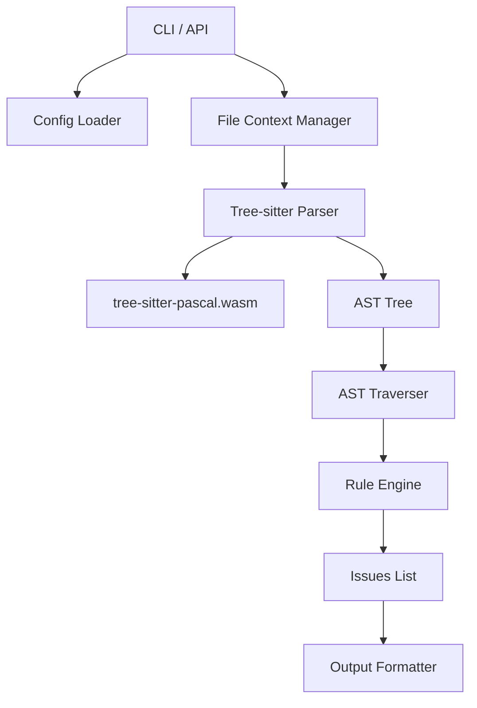

# pslint 实现技术细节

## 1. 核心引擎架构

`pslint` 是 PascalLint 的核心 CLI 工具和库，旨在独立于 IDE 运行，支持 CI/CD 集成。



## 2. 关键模块

### 2.1 Parser (解析器)
*   **技术**: `web-tree-sitter` (Node.js 环境)
*   **资源**: 加载 `tree-sitter-pascal.wasm` 文件。
*   **特性**:
    *   **增量解析 (Incremental Parsing)**: 在编辑器模式下，复用旧 AST，仅重解析变更部分。
    *   **容错性**: 即使代码有语法错误，也能生成部分有效的 AST，保证 Linter 可用。

### 2.2 Rule Engine (规则引擎)
*   **接口定义**:
    ```typescript
    interface LintRule {
        id: string;
        meta: RuleMeta;
        create(context: RuleContext): RuleListener;
    }
    
    type RuleListener = {
        [nodeType: string]: (node: SyntaxNode) => void;
    };
    ```
*   **调度机制**: 采用观察者模式。一次 AST 遍历，触发所有活跃规则的监听器，效率最大化。

### 2.3 Configuration (配置系统)
*   **加载顺序**:
    1. CLI 参数 (`--config`)
    2. `.PascalLint.json` / `.PascalLint.js`
    3. `package.json` 中的 `pascalLintConfig` 字段
    4. 默认配置
*   **配置项**:
    *   `extends`: 继承预设配置
    *   `rules`: 启用/禁用规则及参数设置
    *   `parserOptions`: 解析器选项 (如 Delphi 版本兼容性)
    *   `ignorePatterns`: 忽略文件列表

## 3. CLI 实现

### 3.1 命令结构
```bash
pslint [options] [file|dir|glob]
```

### 3.2 选项
*   `--fix`: 自动修复可修复的问题。
*   `--format`: 输出格式 (stylish, json, unix, sonar)。
    *   `sonar`: 输出 SonarQube [Generic Issue Import Format](https://docs.sonarsource.com/sonarqube/latest/analyzing-source-code/importing-external-issues/generic-issue-import-format/)，方便集成。
*   `--config`: 指定配置文件路径。
*   `--init`: 初始化配置文件向导。

## 4. 性能优化

*   **并行处理**: 利用 Worker Threads 针对多文件进行并行 Lint。
*   **缓存机制**: 利用文件 Hash 缓存 Lint 结果，未变更文件直接跳过。

## 5. 跨平台兼容

*   确保路径分隔符处理正确 (使用 `path.normalize`)。
*   WASM 文件加载路径在不同 OS 下的兼容性。
